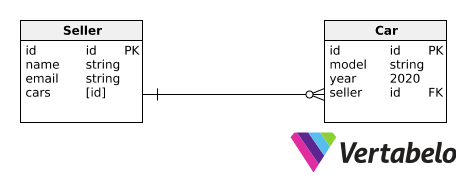

# Referencing-Mongoose

Implementation of one to many referencing with mongoose. 

Visual Representation: 

In this db model. Each car has only one seller but each seller has one or more cars. This is why this is a one to many relationship. 

We achieve this using referencing. 

We reference the id of seller in the car schema and we reference the id of each car that the seller sells in the seller schema. 

